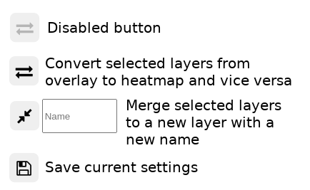

# properties_map
Displays interactive data like public transportation, supermarkets and apartments available for rent in the city of Leipzig.

Transportation and supermarkets are based on [OpenStreetMap's](https://www.openstreetmap.org) data as pbf files.
Available apartments are scraped from 3 different sites ([immobilienscout24](https://www.immobilienscout24.de/), [immowelt](https://www.immowelt.de/), [immonet](https://www.immonet.de/))


# [interactive example](https://korn-alex.github.io/properties_map/demo)


### JS libraries used to display data
- [leaflet.js](https://leafletjs.com/) (modified)
- [Leaflet.heat](https://github.com/Leaflet/Leaflet.heat) (modified)


### requirements
- OSM data (available at http://download.geofabrik.de/)
- python3.8

### Installation
1. Clone or download repository.
2. Create a virtual environment inside the repository.
    ```sh
    python -m venv .env
    ``` 
3. Activate environment.

    Linux:
    ```sh
    . .env/bin/activate
    ```
    Windows:
    ```ps
    .env/Scripts/activate.ps1
    ```

4. Install dependencies.
    ```sh
    pip install -r requirements.txt
    ```

### Example Setup

1. Place `data.osm.pbf` file into `data` folder
2. (Optional) Reduce area boundary of `data.osm.pbf` by using `handlers.AreaWriterHandler` in `properties_map/handlers.py` to speed up the search.
3. Run `examples/public_transportation.py`, it may take a while. Creates a database with public transportation data in `data/geojson/geojson.db`
4. Run `examples/supermarket.py`. Searches for supermarkets.
5. Specify your needed data in `client/templates/map.html` like:
    
    [database_table, database_id]
    ```
    let requests = [
        ['Line',20],
        ['Stops',20],
        ['Amenity',0],
    ]
    var controlOverlay = new LayerControlOverlay(map, requests);
    ```
6. Run flask server by using one of the provided scripts from `scripts` folder. The OSM data should be ready to use.

7. Open browser (http://localhost:5000/)

8. (Optional) Update apartments database with apartment controls. Can take up to 10 minutes on the first run.
    

### Map controls
Hover over to expand.


#### Overlay controls
Left checkboxes toggle visibility on the map of the layer.

Right checkboxes select operations.


##### Buttons




- convert: converts selected layers to heatmap / overlay


- merge: merges 2 or more layers together and appends a new layer with the given merged name


- save settings: writes current layer / heatmap settings to `data/settings.json`

#### Heatmap controls


Updates radius, intensity and blur of all points of this layer.

[controls demo gif](https://imgur.com/Ah7GTYj.gifv)


#### Apartment controls

##### Buttons


Hide an apartment by clicking the trash icon.
To revert it, click the undo button in the apartment control.


To add a missing address, click on address symbol then drag the map to the right position and set the marker.


### Settings

Each layer has a style or an icon option.
Once the settings are saved from the map controls, you change them in `data/settings.json`.

#### Style
Style settings are used for lines.
You can find all options in the [leaflet documentation](https://leafletjs.com/reference-1.6.0.html#path-option).

Example:
```
"style": {
    "bubblingMouseEvents": true,
    "color": "cyan",
    "interactive": true,
    "lineCap": "round",
    "lineJoin": "round",
    "opacity": 0.5,
    "pane": "overlayPane",
    "smoothFactor": 1,
    "stroke": true,
    "weight": 16
},
```

#### Icon
Icon settings are used for points. 
They are provided by [fontawesome](https://fontawesome.com/v4.7.0/icons/).
To change the bus icon in the below example, you need to find an icon name from fontawesome. Then replace "fa-bus" to your icon and change "className" to your custom css classes for color control.

Example:
```
"icon": {
    "options": {
        "className": "public-stop bus-icon",
        "html": "<span class=\"fa-stack fa-1x\"><i class=\"fa fa-circle fa-stack-2x\"></i><i class=\"fa fa-bus fa-stack-1x\"></i></span>"
    },
},
```

#### Heatmap
```
"heatmap": {
    "blur": 0,
    "gradient": {
        "0.3": "red",
        "0.7": "orange",
        "0.9": "yellow",
        "1.0": "white"
    },
    "max": 0.1,
    "radius": 139
},
```
When you are done, save the file and reload the page.